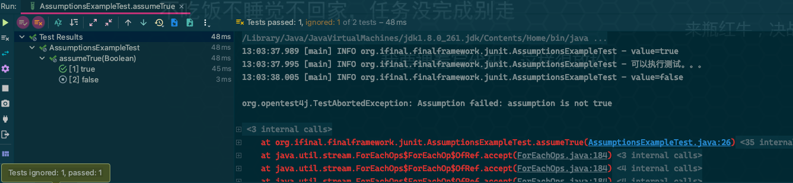
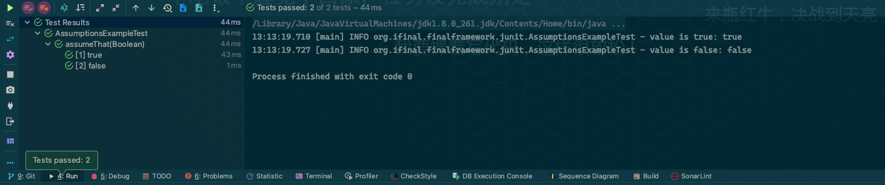

# Assumptions

## What

`Assumptions`是`JUnit`提供的**假设**工具类，用于仅当满足**假设条件**时才需要进行测试的场景。

## Features

`Assumptions`提供了以下三个静态方法用于假设：

* `assumeTrue(boolean)`
* `assumeFalse(boolean)`
* `assumingThat(boolean,Executable)`

其中，使用`assumeTrue()`和`assumeFalse()`两个假设方法的的测试用例仅当假设条件成立时才会执行，如果条件不成立，
会抛出**测试中断异常**`TestAbortedException`,从而终止该测试用例的执行。

而`assumingThat()`用于当假设条件满足时再执行测试，否则不执行。

## Usage

### assumeTrue

```java
package org.ifinal.finalframework.junit;

import lombok.extern.slf4j.Slf4j;
import org.junit.jupiter.params.ParameterizedTest;
import org.junit.jupiter.params.provider.ValueSource;

import static org.junit.jupiter.api.Assertions.*;
import static org.junit.jupiter.api.Assumptions.*;

@Slf4j
class AssumptionsExampleTest {

    @ParameterizedTest
    @ValueSource(booleans = {true,false})
    void assumeTrue(Boolean value) {
        logger.info("value={}", value);
        Assumptions.assumeTrue(value);
        assertTrue(value);
        logger.info("可以执行测试。。。");
    }

}

```

执行结果：



### assumingThat

```java
package org.ifinal.finalframework.junit;

import lombok.extern.slf4j.Slf4j;
import org.junit.jupiter.api.Assertions;
import org.junit.jupiter.api.Assumptions;
import org.junit.jupiter.params.ParameterizedTest;
import org.junit.jupiter.params.provider.ValueSource;

import static org.junit.jupiter.api.Assertions.*;
import static org.junit.jupiter.api.Assumptions.*;

@Slf4j
class AssumptionsExampleTest {

    @ParameterizedTest
    @ValueSource(booleans = {true, false})
    void assumeThat(Boolean value) {
        assumingThat(value, () -> {
            logger.info("value is true: {}", value);
            assertTrue(value);
        });

        assumingThat(!value, () -> {
            logger.info("value is false: {}", value);
            assertFalse(value);
        });
    }

}
```

执行结果：

